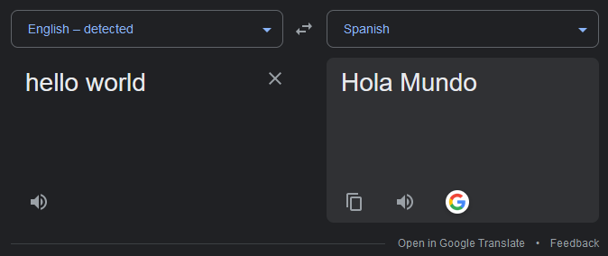
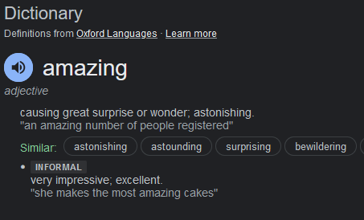

# Types of search results

Currently the following type of search results can be obtained via `search`

> `ResultTypes` is a enum. documentation can be found [here](https://paka.dev/npm/google-sr/api)

### Regular search results

Organic search results / Regular or normal search results

eg: "**node js**"

These will contain `type: ResultTypes.SearchResult`

> Note: All other types **takes priority over these values**

### Translations

Search result that are obtained via translation queries

eg: "**Translate hello to spanish**"

These will contain `type: ResultTypes.TranslateResult`

### Dictionary

Search results obtained via "define" queries

eg: "**define amazing**"

These will contain `type: ResultTypes.DictionaryResult`

### Current time

Search results obtained via "current time" queries

eg: "**what is the current time in uk**"

These will contain `type: ResultTypes.TimeResult`

### Currency conversions

Search results obtained via "Currency conversions" queries

eg: "**Convert 10 usd to cad**"

These will contain `type: ResultTypes.CurrencyResult`

